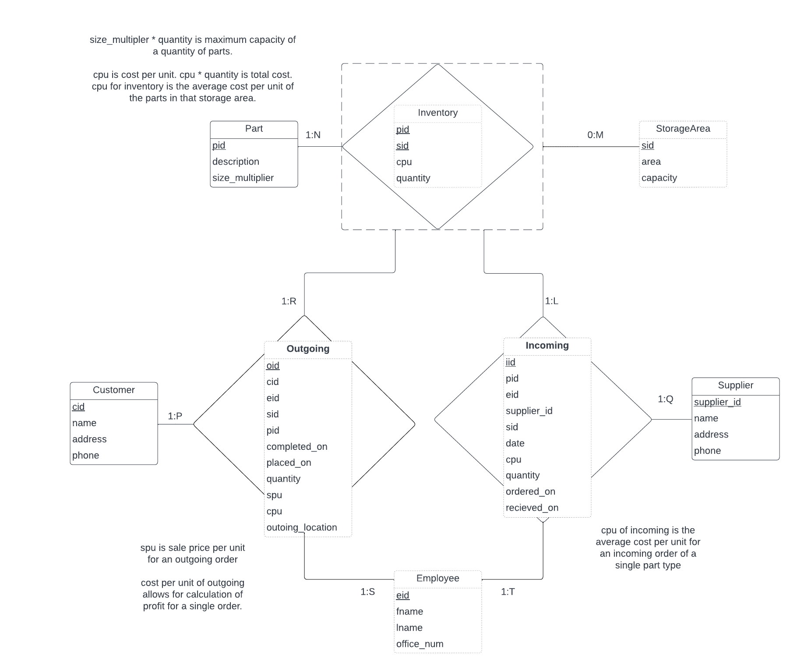
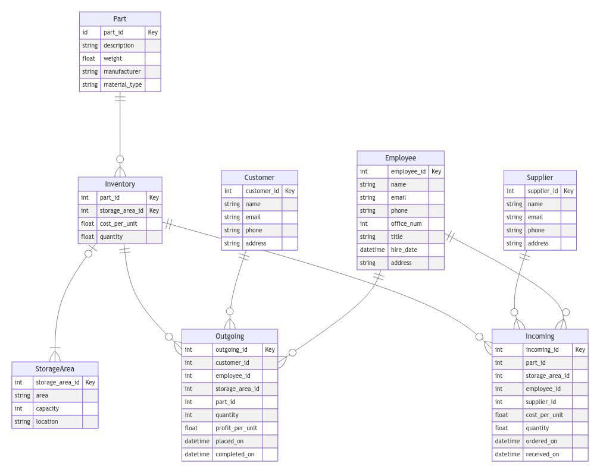

# Aircraft Parts Distribution Center 

CS:4400 Database Systems 
Group 2 
Yiqi Liu, Daniel Dagle, Eric Trautsch 

## Goal & Project Context 

The goal of this project is to create a database for a distribution center holding specialized parts for aircraft repair. This type of warehouse would store parts for extended periods of time to allow for the service time of aircraft (~30 years) to have replacement parts available over its entire lifecycle. Therefore, this project will focus on managing inventory for a full parts warehouse and supporting employees' efforts to find and locate parts and their locations in the storage areas.  

## Business Questions 

#### Employee Questions
-   Where can I find part id P1023 in the warehouse to pick and add to an outgoing shipment? 
-   Given I have a new shipment of part P1023, are there any storage locations with this same part that can fit the new parts? 
-   What are the storage locations with a capacity large enough to fit a new incoming shipment of part X of quantity Y?  

#### Management Questions
-   What parts are in the highest outgoing demand? 
-   How much inventory of part X do we have and where are all the locations it is stored? 
-   What parts do we need to order more of? 
-   What are our profits for the previous month/quarter/year? 
-   What time of the week is our demand for orders the highest and should we have the most employees working? 

## User Types

There are a few types of users that will use this database. First, Floor managers will use the incoming and outgoing to understand what work Employees need to complete and priority to help direct them. Employees will need to view the incoming and outgoing jobs to complete the work. The Sales team will need information about outgoing orders and profits and customers, and the purchasing team (orders new material) will need to understand what material is incoming and outgoing of the parts warehouse as well as views for the Suppliers. 

- Admin user
- Floor Managers user
- Employee user 
- Sales user
- Purchasing user
- Inventory Analyst Role

## User Views

#### Customer Views
need user views for tracking their Order history, as well as getting a Product catalog view to order product from. 
Order.
Product Catalog Note the cost_per_unit must be modified for this view to be the expected sale price.  

#### Employee Views
Customer Order view: Includes the attributes of the outgoing relationship. 

Supplier Order view: Includes the attributes of the Incoming relationship . 

Inventory view: Includes the attributes of the Inventory relationship, as well as the Part entity attributes  and the StorageArea entity attributes. 

#### Supplier views: 
Order History view: Includes the attributes of the Incoming relationship and information abuot the Supplier. 

## Sample Functions 

To accomplish these goals, we focus on a few functions that will provide illustrative answers. To figure out which parts are in highest demand, we will need some measure of parts incoming and outgoing through time. To understand what the current stock is, we need to maintain a record of inventory with attached storage areas. Each storage area is a standard area in the quantity of our current inventory in that part, and some measure of demand, shown from past transactions in that part. Using this information, that function could provide some measure of demand that could be sorted on all the parts to compute a measure of demand that can be compared between parts.  

One more function would be to facilitate a pick, or an employee retrieving parts to fulfill a transaction. This function would show all open storage areas with this part. This function would need to balance a tradeoff between closing out storage bins (e.g., creating an empty storage bin) and requiring a minimum of physical storage locations visited. 

## Assumptions 

-   We assume that customers and suppliers are managed by other departments, and we have a fully filled customer database to work with. 
-   We assume that operator error will be fixed by analysts and inspectors on the floor, and we do not have to worry about discrepancies in stock between the database and reality. 
-   We assume that employees and management have distinct roles and do not need to be managed. Aside from maintaining the cost of each part, we do not have to manage assets for payroll, maintenance, or anything beyond being able to spend on purchasing new parts and tracking the profits from the outgoing shipments of parts. 
-   We assume that employees can open new storage locations and put the parts inside, and we do not have to decide where to store new parts beyond listing open storage locations. 
-   We assume that new orders will be placed by the sales team and populated into an Orders table provided, which will contain information about an order and the parts and sale price sold. 

## Scope 

We plan to focus on the warehouse side of the business. This will mean we have a list of storage locations, their size, the current part, and their physical location. We will also have a list of outgoing orders that contains parts and quantities and sale price.  

We also will have a parts table with the part id, the cost per part, and some identifying information. Each Part is a category of parts, being a type of wheel, wing, or chip, of which multiple of these parts can be stored in inventory.  

In this, we plan to focus on the parts, transactions, storage locations, and inventory. This focus allows us to facilitate day-to-day operation of the warehouse, and focusing on the profits can provide management with a better understanding of how they are doing. We will not include asset management or the responsibilities of any group outside the logistics team internal to the warehouse. 

## ER Model 

This is the previous ER model



This is an updated ER Model for this submission of the document.




## Entities 

-   Part – This tracks the various types of parts held within the warehouse. 
-   StorageArea – Each instance represents an independent section of the warehouse. 
-   Customer – Each instance represents a customer ordering parts from our warehouse. 
-   Supplier – Each instance represents a supplier from whom we purchase parts. 
-   Employee – Each instance represents a single employee at our warehouse. 
    

## Relationships 

-   Inventory – Each instance a part type and in which storage area it can be found. 
-   Outgoing – Each instance represents a part order shipped to a customer. 
-   Incoming – Each instance represents a part shipment ordered from a supplier. 

## Attributes 


Based on the above ER model, the attributes are as follows:

| Entity     | Attribute        | Description                                   |
|------------|------------------|-----------------------------------------------|
| Part       | part_id (Key)    | Unique identifier for a part                  |
|            | description      | Description of the part                       |
|            | weight           | Weight of the part in pounds                   |
|            | manufacturer     | Name of the manufacturer of the part           |
|            | material_type    | Type of material the part is made from         |
| Inventory  | part_id (Key)    | Unique identifier for a part in inventory      |
|            | storage_area_id  | Unique identifier for a storage area in inventory |
|            | cost_per_unit    | Cost per unit of the part in inventory         |
|            | quantity         | Quantity of the part in inventory              |
| StorageArea| storage_area_id (Key) | Unique identifier for a storage area     |
|            | area             | Description of the storage area                |
|            | capacity         | Maximum capacity of the storage area           |
|            | location         | Location of the storage area                   |
| Outgoing   | outgoing_id (Key)| Unique identifier for an outgoing order        |
|            | customer_id      | Unique identifier for the customer             |
|            | employee_id      | Unique identifier for the employee             |
|            | storage_area_id  | Unique identifier for the storage area          |
|            | part_id          | Unique identifier for the part in the order     |
|            | quantity         | Quantity of the part in the order               |
|            | profit_per_unit  | Profit per unit of the part in the order        |
|            | placed_on        | Date and time when the order was placed         |
|            | completed_on     | Date and time when the order was completed      |
| Incoming   | incoming_id (Key)| Unique identifier for an incoming order         |
|            | part_id          | Unique identifier for the part in the order     |
|            | storage_area_id  | Unique identifier for the storage area          |
|            | employee_id      | Unique identifier for the employee placing the order |
|            | supplier_id      | Unique identifier for the supplier              |
|            | cost_per_unit    | Cost per unit of the part in the order           |
|            | quantity         | Quantity of the part in the order                |
|            | ordered_on       | Date and time when the order was placed          |
|            | received_on      | Date and time when the order was received        |
| Supplier   | supplier_id (Key)| Unique identifier for the supplier              |
|            | name             | Name of the supplier                            |
|            | address          | Address of the supplier                         |
|            | phone            | Phone number of the supplier                     |
|            | email            | Email address of the supplier                    |
| Customer   | customer_id (Key)| Unique identifier for the customer               |
|            | name             | Name of the customer                             |
|            | address          | Address of the customer                          |
|            | phone            | Phone number of the customer                      |
|            | email            | Email address of the customer                     |
| Employee   | employee_id (Key)| Unique identifier for the employee                |
|            | name             | Name of the employee                              |
|            | address          | Address of the employee                           |
|            | phone            | Phone number of the employee                       |
|            | office_num       | Office number of the employee                      |
|            | email            | Email address of the employee                      |
|            | title            | Job title of the employee                          |
|            | hire_date        | Date the employee was hired


## Relational Schema (3rd normal form) 

Part(__part_id__, description, weight, manufactuer) 

StorageArea(__storage_area_id__, area, capacity) 

Inventory(__part_id__, __storage_area_id__, quantity)

PartCosts(__part_id__, __supplier_id__, __date__, cost_per_unit)

Customer(__cid__, name, address, phone) 

Supplier(__supplier_id__ ,name, address, phone) 

Employee(**employee_id**, name, email, title, hire_date, office_num) 

Outgoing(__customer_id__, employee_id, storage_area_id, __part_id__, completed_on, __placed_on__, quantity, profit_per_unit, cost_per_unit, outgoing_location)

Incoming(__part_id__, employee_id, __supplier_id__, storage_area_id, cost_per_unit, quantity, __ordered_on__, received_on) 


## Relational Schema (BCNF) 

Currently no change as only Inventory has multi-attribute keys 

## Referential Integrity Constraints 

| Relation   | Foreign Key    | Referenced Primary Key |
|------------|-----------------|------------------------|
| Inventory  | part_id         | Part(part_id)           |
| Inventory  | storage_area_id | StorageArea(storage_area_id)   |
| Outgoing   | customer_id     | Customer(customer_id)   |
| Outgoing   | employee_id     | Employee(employee_id)   |
| Outgoing   | storage_area_id | StorageArea(storage_area_id)   |
| Outgoing   | part_id         | Part(part_id)           |
| Incoming   | part_id         | Part(part_id)           |
| Incoming   | storage_area_id | StorageArea(storage_area_id)   |
| Incoming   | employee_id     | Employee(employee_id)   |
| Incoming   | supplier_id     | Supplier(supplier_id)   |
| PartCosts  | part_id         | Part(part_id)           |
| PartCosts  | supplier_id     | Supplier(supplier_id)   |
| PartCosts  | date            | Incoming(date)          |
| PartCosts  | cost_per_unit             | Incoming(cost_per_unit)           |

## Loss

Only one relation was decomposed, PartCosts from Inventory.

| R          | part_id (P) | storage_area_id (S) | quantity (Q) | cost_per_unit (C) | date (D) | Supplier_ID (Sup) |
|------------|-------------|---------------------|--------------|---------|----------|-------------------|
| Inventory  | P           | S                   | Q            | C1      | D1       | Sup1              |
| PartCosts  | P           | S2                  | Q2           | C       | D        | Sup               |

## Functional Dependencies (non-trivial) 

-   Part(part_id) → description, weight, manufacturer, material_type
-   Inventory(part_id, storage_area_id) → cost_per_unit, quantity
-   StorageArea(storage_area_id) → area, capacity, location
-   Outgoing(outgoing_id) → customer_id, employee_id, storage_area_id, part_id, quantity, profit_per_unit, placed_on, completed_on
-   Incoming(incoming_id) → part_id, storage_area_id, employee_id, supplier_id, cost_per_unit, quantity, ordered_on, received_on
-   Supplier(supplier_id) → name, address, phone, email
-   Customer(customer_id) → name, address, phone, email
-   Employee(employee_id) → name, address, phone, office_num, email, title, hire_date

## Initial Schema for each User views

#### Customer Views

CustomerOrderHistory(__customer_id__, employee_id, storage_area_id, __part_id__, completed_on, __placed_on__, quantity, profit_per_unit, cost_per_unit, outgoing_location)

ProductCatalog(__part_id__, description, weight, manufactuer, total_quantity)


#### Employee Views Schemas

StockView(__part_id__, __storage_area_id__, description, weight, manufacturer, quantity, area, capacity)

#### Supplier views: 

OrderHistoryView(__supplier_id__, name, address, phone, __part_id__, quantity, cost_per_unit, __ordered_on__, received_on)


## Data Dictionary 


Based on the normalized database design, our data dictionary takes this form:

| Entity     | Attribute        | Description                                   | Data Type | Notes                    |
|------------|------------------|-----------------------------------------------|-----------|--------------------------|
| Part       | part_id          | Unique identifier for a part                  | INT       | Primary key              |
|            | description      | Description of the part                       | VARCHAR   |                          |
|            | weight           | Weight of the part in pounds                   | FLOAT     |                          |
|            | manufacturer     | Name of the manufacturer of the part           | VARCHAR   |                          |
|            | material_type    | Type of material the part is made from         | VARCHAR   |                          |
| Inventory  | part_id          | Unique identifier for a part in inventory      | Integer       | Foreign key (Part)       |
|            | storage_area_id  | Unique identifier for a storage area in inventory | Integer    | Foreign key (StorageArea) |
|            | cost_per_unit    | Cost per unit of the part in inventory         | FLOAT     |                          |
|            | quantity         | Quantity of the part in inventory              | Integer       |                          |
| StorageArea| storage_area_id  | Unique identifier for a storage area           | Integer       | Primary key              |
|            | area             | Description of the storage area                | VARCHAR   |                          |
|            | capacity         | Maximum capacity of the storage area           | Integer       |                          |
|            | location         | Location of the storage area                   | VARCHAR   |                          |
| Outgoing   | customer_id      | Unique identifier for the customer                   | Integer      | Foreign key (Customer)                   |
|            | employee_id      | Unique identifier for the employee                   | Integer      | Foreign key (Employee)                   |
|            | storage_area_id  | Unique identifier for the storage area                | Integer      | Foreign key (StorageArea)                |
|            | part_id          | Unique identifier for the part in the order           | Integer      | Foreign key (Part)                       |
|            | quantity         | Quantity of the part in the order                     | Integer      |                                                |
|            | profit_per_unit  | Profit per unit of the part in the order              | FLOAT    |                                                |
|            | placed_on        | Date and time when the order was placed               | datetime |                                                |
|            | completed_on     | Date and time when the order was completed            | datetime |                                                |
|    Incoming        | part_id          | Unique identifier for the part in the order     | Integer       | Foreign key (Part)       |
|            | storage_area_id  | Unique identifier for the storage area          | Integer       | Foreign key (StorageArea)|
|            | employee_id      | Unique identifier for the employee placing the order | Integer  | Foreign key (Employee)   |
|            | supplier_id      | Unique identifier for the supplier              | Integer       | Foreign key (Supplier)   |
|            | cost_per_unit    | Cost per unit of the part in the order           | FLOAT     |                          |
|            | quantity         | Quantity of the part in the order                | INT       |                          |
|            | ordered_on       | Date and time when the order was placed          | DATETIME  |                          |
|            | received_on      | Date and time when the order was received        | DATETIME  |                          |
| Supplier   | supplier_id      | Unique identifier for the supplier            | Integer  | Primary Key                                 |
|            | name             | Name of the supplier                           | VARCHAR     |                                             |
|            | address          | Address of the supplier                        | VARCHAR     |                                             |
|            | phone            | Phone number of the supplier                    | VARCHAR     |                                             |
|            | email            | Email address of the supplier                   | VARCHAR     |                                             |
| Customer   | customer_id      | Unique identifier for the customer             | Integer  | Primary Key                                 |
|            | name             | Name of the customer                            | VARCHAR     |                                             |
|            | address          | Address of the customer                         | VARCHAR     |                                             |
|            | phone            | Phone number of the customer                     | VARCHAR     |                                             |
|            | email            | Email address of the customer                    | VARCHAR     |                                             |
| Employee   | employee_id      | Unique identifier for the employee              | Integer  | Primary Key                                 |
|            | name             | Name of the employee                             | VARCHAR     |                                             |
|            | address          | Address of the employee                          | VARCHAR     |                                             |
|            | phone            | Phone number of the employee                      | VARCHAR     |                                             |
|            | office_num       | Office number of the employee                     | VARCHAR     |                                             |
|            | email            | Email address of the employee                     | VARCHAR     |                                             |
|            | title            | Job title of the employee                         | VARCHAR     |                                             |
|            | hire_date        | Date the employee was hired                       | Date     |                                             |

## Database Authorization Strategy 

Using CRUD (Create, Read, Update, Delete) to show permissions on each table by each role.

| Tables                      | Admin | Floor Managers | Warehouse Employees | Sales Role | Purchasing Role | Inventory Analyst Role |
|-----------------------------|-------|----------------|----------|-------|------------|-------------------|
| Part                        | CRUD  | R              | R        | R     | R          | CRUD                 |
| StorageArea                 | CRUD  | CRUD           | R        | R     |           | CRUD              |
| Customer                    | CRUD  | R              | R        | CRUD  | CRU          | R                 |
| Supplier                    | CRUD  | R              | R        | R     | R       | R                 |
| Employee                    | CRUD  | CRUD           | R     | R (On themselves)     |      | R              |
| Inventory                   | CRUD  | CRUD           | CRU        | R     | R          | CRUD              |
| Outgoing                    | CRUD  | CRUD           | RU        | R     | CRUD          | R                 |
| Incoming                    | CRUD  | CRUD           | RU        | R     | CRUD       | R                 |


## Relational Normalization from R 

Single Relation, R.

```markdown
R(__part_id__, description, weight, manufacturer, __storage_area_id__, area, capacity, inv_quantity, inc_quantity, __supplier_id__, __date__, cpu, __cid__, e_name, e_address, e_phone, c_name, c_address, c_phone, **employee_id**, email, title, hire_date, office_num, __customer_id__, completed_on, __placed_on__, profit_per_unit, outgoing_location, __ordered_on__, received_on)
```


Decompose into the following to reduce redundency:


```
Part(part_id, description, weight, manufactuer)

StorageArea(storage_area_id, area, capacity)

Supplier(supplier_id, name, address, phone)

Customer(cid, name, address, phone)

Employee(employee_id, name, email, title, hire_date, office_num)

Inventory(part_id, storage_area_id, quantity)

Outgoing(customer_id, employee_id, part_id, storage_area_id, completed_on, placed_on, quantity, profit_per_unit, cost_per_unit, outgoing_location)

Incoming(part_id, employee_id, supplier_id, storage_area_id, cost_per_unit, quantity, ordered_on, received_on)
```

And mix to get:


Part(__part_id__, description, weight, manufacturer)

StorageArea(__storage_area_id__, area, capacity)

Supplier(__supplier_id__, name, address, phone)

Customer(__customer_id__, name, address, phone)

Employee(__employee_id__, email, title, hire_date, office_num)

Outgoing(__customer_id__, employee_id, storage_area_id, __part_id__, completed_on, __placed_on__, profit_per_unit, outgoing_location)

Incoming(__part_id__, __supplier_id__, ordered_on, __received_on__, quantity, cost_per_part, __part_id__, storage_area_id)

Inventory(__part_id__, __storage_area_id__, quantity)

As the final relations.

## Implementation

!!!